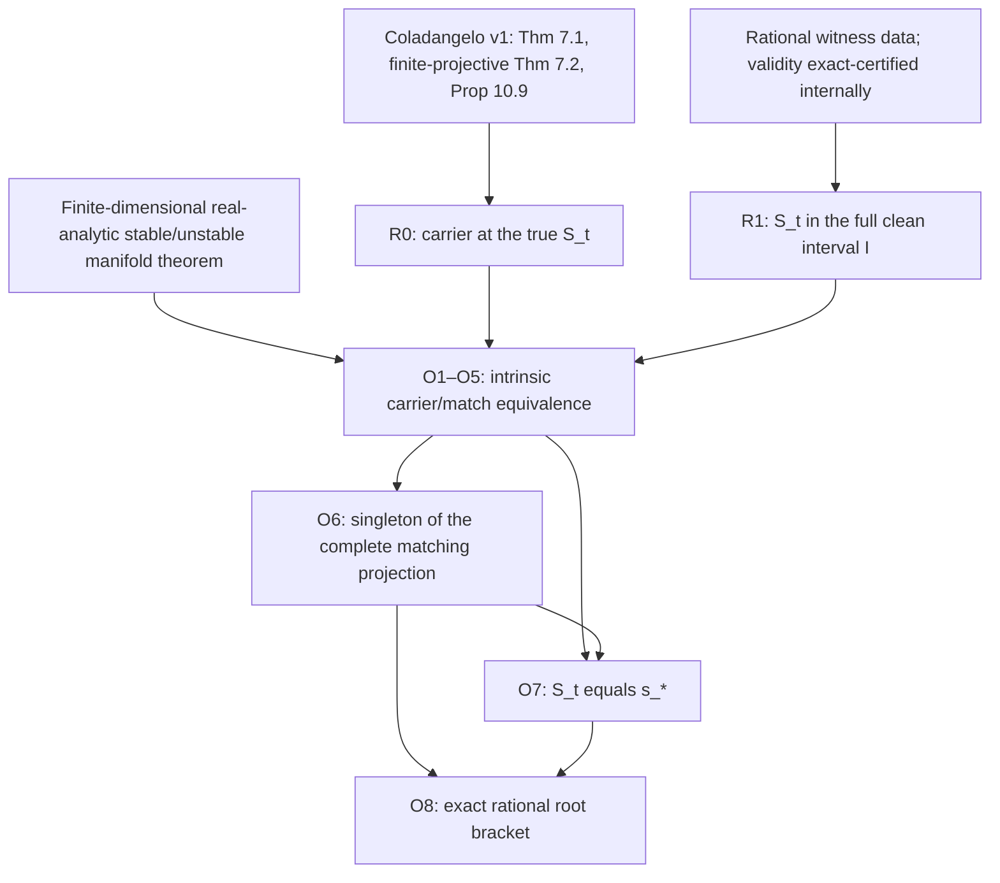

# Load-bearing dependency graph

R1's rational data origin is distinct from a literature theorem premise. Ordinary finite spectral theory, compactness, concavity, contraction and inverse-function arguments remain explicit mathematical foundations. The [external premise list](EXTERNAL_PREMISES.md) describes the narrow interfaces and their shared ancestry.

| Step | Mathematical output | Role in the next step |
|---|---|---|
| R1 | `S_t ∈ I=(L,U]` | Establishes the entire quantified domain, not the fine root bracket |
| R0 | `C_(S_t)` is nonempty | Supplies one positive square-summable decreasing outer carrier |
| O1 | Clean `I`, outer branch `T=a(I)` | Fixes normalization and parameter conversion |
| O2 | Intrinsic analytic local tails and eventual capture | Relates convergent carrier tails to the local manifolds |
| O3 | Full match implies an admissible normalized carrier | Reconstructs every ratio and square-summable amplitude |
| O4 | Admissible carrier implies a full match | Includes exact-zero crossing and arbitrary valid finite chains |
| O5 | `M_(S_t)` is nonempty | Applies R0/R1 and the bridge |
| O6 | `π_s(M)={s_*}` on all `I` | Excludes independent-phase asymmetric matches and proves global uniqueness |
| O7 | `S_t=s_*` | Typed membership in the same singleton projection |
| O8 | Strict rational bounds on `s_*`, hence `S_t` | Same analytic germ, exact signs, 13 Newton inclusions and width |

Audits validate the chain but are not mathematical premise nodes. The manuscript and project history are not premise nodes. The rejected Sol O6 proof is absent from the canonical chain. R2 is excluded. No finite attainment, unique carrier, or unique optimizer is needed.

[Crosswalk](THEOREM_CROSSWALK.md) · [Machine/analytic boundary](MACHINE_ANALYTIC_BOUNDARY.md) · [Current validation](../docs/VALIDATION_STATUS.md)
